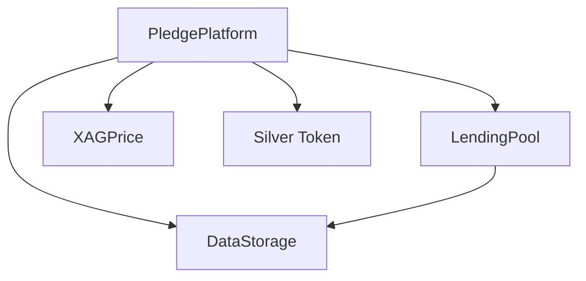

# Critical Money Protocol Documentation

## Overview

The Critical Money protocol is a decentralized finance (DeFi) system that enables users to obtain USDC loans backed by silver. The protocol consists of multiple smart contracts working together to handle silver tokenization, price feeds, lending, and pledge management.

## Core Contracts

### [PledgePlatform](doc/PledgePlatform.md)
The central contract that coordinates silver pledges, loan origination, and repayment:
- Pledge registration and management
- Silver token minting
- Loan disbursement coordination
- Payment processing

### [DataStorage](doc/DataStorage.md)
The foundational data layer that maintains the protocol's state:
- Pledge data structures
- User balances
- Payment tracking
- Investor management

### [LendingPool](doc/LendingPool.md)
Manages the lending aspects of the protocol:
- USDC deposits from investors
- Loan disbursement
- Payment collection
- Reward distribution

### [XAGPrice](doc/XAGPrice.md)
Oracle contract providing silver price data:
- Chainlink price feed integration
- Price validation
- Staleness checks
- Decimal normalization

## Contract Relationships



## Quick Links

1. **For Developers**
   - [Development Setup](doc/setup.md)
   - [Integration Guide](doc/integration.md)
   - [API Reference](doc/api.md)

2. **For Users**
   - [User Guide](doc/user-guide.md)
   - [FAQ](doc/faq.md)

3. **For Admins**
   - [Deployment Guide](doc/deployment.md)
   - [Maintenance](doc/maintenance.md)

## Core Concepts

### Pledge Process
1. User requests silver-backed loan
2. Admin validates and registers pledge
3. Silver tokens minted to user
4. USDC loan disbursed from lending pool
5. User makes payments over time
6. Pledge marked redeemable upon full payment

### Investment Process
1. Investors deposit USDC to lending pool
2. Pool distributes USDC for silver-backed loans
3. Payments from borrowers generate rewards
4. Rewards distributed pro-rata to investors

## Security Model

- **Access Control**: Role-based permissions (pledgee, investors)
- **Price Safety**: Chainlink oracle with staleness checks
- **Fund Security**: ReentrancyGuard implementation
- **State Management**: Structured data storage

## Protocol Parameters

| Parameter | Value | Description |
|-----------|--------|-------------|
| Loan Term | 365 days | Duration of silver-backed loans |
| Price Feed | XAG/USD | Silver price oracle |
| Min Amount | > 0 | Minimum pledge amount |
| Token | USDC | Loan and payment currency |

## Getting Started

1. **For Developers**
   ```bash
   git clone https://github.com/raspcwalter/CriticalMoney/
   cd CriticalMoney
   forge install
   forge test
   ```

2. **For Users**
   - Review [User Guide](doc/user-guide.md)
   - Prepare silver documentation
   - Contact admin for pledge registration

3. **For Investors**
   - Review [Investment Guide](doc/investment.md)
   - Prepare USDC for deposit
   - Monitor reward accumulation

## Additional Resources

- [GitHub Repository](https://github.com/raspcwalter/CriticalMoney/)
- [Technical Whitepaper](doc/whitepaper.md)
- [Audit Reports](doc/audits/)
- [Community Forum](https://forum.criticalmoney.com)

## Contributing

1. Fork the repository
2. Create feature branch
3. Submit pull request
4. Follow coding standards
5. Include tests

## Support

- [Discord Community](https://discord.gg/criticalmoney)
- [Technical Support](mailto:support@criticalmoney.com)
- [Bug Reports](https://github.com/your-org/critical-money/issues)

## License

MIT License - see [LICENSE](LICENSE) file for details
