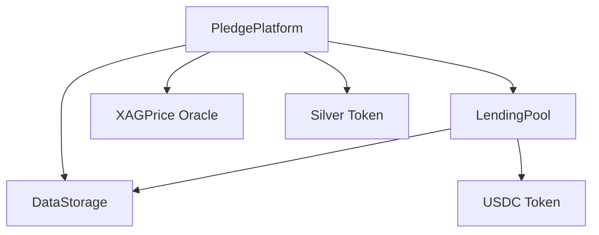

# Critical Money Contract Documentation

## Overview

Critical Money is a DeFi protocol for borrowing USDC against silver collateral. The system consists of three main contracts that work together:

1. `DataStorage` - The base storage layer managing pledges and user balances
2. `LendingPool` - USDC liquidity pool and reward distribution system
3. `PledgePlatform` - Main business logic coordinating silver pledges and loans

## Contract Architecture



## DataStorage Contract

### Purpose
Base contract providing storage structures and mappings for pledges, user balances, and reward tracking. Acts as a shared data layer for `PledgePlatform` and `LendingPool`.

### Key Structures

#### Pledge
```solidity
struct Pledge {
    address pledgor;        // Owner of the pledged asset
    uint256 quantityInOunces;  // Amount of silver pledged
    uint256 pledgeDate;     // When pledge was created
    uint256 redemptionDate; // When pledge can be redeemed
    uint256 agreementId;    // Unique identifier
    bool redemptionApproved; // Whether pledge is ready for redemption
    uint256 ouncePrice;     // XAG/USD price at pledge time
}
```

#### UserData
```solidity
struct UserData {
    address user;    // User address
    uint256 principal; // Principal amount in USDC
}
```

### State Variables
- `address public pledgee` - Administrator address
- `uint256 public agreementId` - Sequential pledge identifier
- `uint256 public pendingRewards` - Accumulated rewards to distribute
- `mapping(uint256 => Pledge) public pledges` - All pledges by ID
- `mapping(address => uint256[]) public idByPledgor` - Pledge IDs per user
- `mapping(address => UserData) public userBalances` - User principal balances
- `mapping(address => bool) public isInvestor` - Investor status flags
- `mapping(address => uint256) public rewards` - Claimable rewards per user
- `mapping(address => uint256) public redemptions` - Redemption counts
- `address[] public investors` - List of all investors

## LendingPool Contract

### Purpose
Manages the USDC liquidity pool, handles deposits from investors, and distributes rewards from borrower spreads.

### Key Features
- USDC deposit/withdrawal for investors
- Reward calculation and distribution
- Isolated liquidity management
- Reentrancy protection

### Main Functions

#### lendUSDC
```solidity
function lendUSDC(uint256 amount) external nonReentrant
```
Allows users to deposit USDC into the lending pool to earn rewards from spreads.
- Requires prior USDC approval
- Updates user's principal balance
- Registers new investors
- Emits `PaymentReceived`

#### withdraw
```solidity
function withdraw(uint256 amount) external nonReentrant
```
Allows investors to withdraw their USDC principal.
- Checks user balance and pool reserves
- Updates principal tracking
- Transfers USDC back to user

#### borrow
```solidity
function borrow(address pledgor, uint256 usdcAmount, uint256 spread) external virtual returns (bool)
```
Core lending function called by PledgePlatform.
- Calculates spread and reward distributions
- Transfers USDC to borrower
- Distributes rewards to investors based on their share
- Updates pool reserves

#### distributeRewards
```solidity
function distributeRewards(uint256 totalReward) internal nonReentrant
```
Internal function that handles reward distribution logic:
- Calculates each investor's share based on their principal
- Updates individual reward balances
- Tracks total pending rewards

#### claimRewards
```solidity
function claimRewards() external nonReentrant
```
Allows investors to claim their accumulated rewards.
- Verifies reward balance
- Transfers USDC rewards
- Updates tracking state

### Reward Distribution Table
Spread amount (USDC) | Reward Percentage
--------------------|------------------
< 20,000           | 5%
20,000 - 40,000    | 10%
40,000 - 60,000    | 20%
60,000 - 80,000    | 30%
80,000 - 100,000   | 40%
≥ 100,000          | 50%

## PledgePlatform Contract

### Purpose
Main contract coordinating the lending process: handles silver pledges, interacts with price oracle, and manages loan lifecycle.

### External Dependencies
- `Silver` token contract (ERC-20)
- `XAGPrice` oracle for silver prices
- `LendingPool` for USDC operations
- `USDC` token contract

### Key Functions

#### pledgeRegistry
```solidity
function pledgeRegistry(address _pledgor, uint256 amount, uint256 spread) external onlyPledgee
```
Creates a new silver-backed loan:
1. Whitelists pledgor for Silver token
2. Gets current XAG/USD price
3. Creates Pledge record with 365-day term
4. Mints Silver tokens to pledgor
5. Calculates USDC amount and initiates borrow

#### amortizePledge
```solidity
function amortizePledge(uint256 amount, uint256 pledgeId) external virtual returns (uint256)
```
Handles loan repayments:
- Calculates total debt in USDC
- Tracks payment progress
- Updates redemption approval status
- Returns total amount paid

### Loan Lifecycle

1. **Initialization**
   - Pledgee calls `pledgeRegistry`
   - Silver tokens minted to pledgor
   - USDC transferred from lending pool

2. **Repayment**
   - Pledgor calls `amortizePledge`
   - USDC transferred to lending pool
   - Payment progress tracked

3. **Completion**
   - Full repayment enables redemption
   - Redemption approval flag set

## Security Considerations

### DataStorage
- No direct value transfers
- Inheritable storage pattern
- Clear access control via `pledgee`

### LendingPool
- NonReentrant guards on all value transfers
- Reserve tracking for withdrawal limits
- Rewards calculated proportionally

### PledgePlatform
- Centralized control via pledgee
- Price oracle dependency
- Two-step value transfers

## Integration Flow

1. **Setup**
   - Deploy Silver token
   - Deploy XAGPrice oracle
   - Deploy DataStorage
   - Deploy LendingPool
   - Deploy PledgePlatform

2. **Preparation**
   - Investors approve and deposit USDC to LendingPool
   - Pledgee ready to process loan requests

3. **Lending**
   - Pledgee registers pledge
   - System mints Silver tokens
   - USDC transferred to borrower
   - Rewards distributed to investors

4. **Repayment**
   - Borrower repays via amortizePledge
   - System tracks progress
   - Investors can claim rewards
   - Full repayment enables redemption

## Example Usage

```javascript
// Investor deposits USDC
await usdc.approve(lendingPool.address, amount);
await lendingPool.lendUSDC(amount);

// Pledgee creates loan
await pledgePlatform.pledgeRegistry(
    borrower,
    silverAmount,
    spreadPercent
);

// Borrower makes payment
await usdc.approve(pledgePlatform.address, paymentAmount);
await pledgePlatform.amortizePledge(paymentAmount, pledgeId);

// Investor claims rewards
await lendingPool.claimRewards();
```